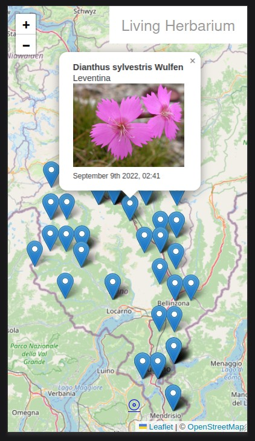

# Living Herbarium

A Data Package that is part of a [#GLAMhack 2022](https://glam.opendata.ch) project to explore an extract from the Swiss National Databank of Vascular Plants and United Herbaria of the University and ETH Zurich. This dataset was recommended and queries provided by Dr. Alessia Guggisberg at the Institute of Integrative Biology (IBZ), ETH Zurich.

For more details visit our [Project Page](https://hack.glam.opendata.ch/project/177)

Screenshot:

## Usage

To run the app, download the source code and install Python3 with pipenv. Navigate to the `api` folder. Then run `pipenv install` followed by `pipenv run python server.py`

If there are no errors navigate to http://localhost:8000/app/index.html 

## Notes

We removed all empty / repetitive columns from the dataset. This is therefore not a 1:1 complete export, and you should visit the [corresponding GBIF query](https://www.gbif.org/occurrence/download?country=CH&dataset_key=83fdfd3d-3a25-4705-9fbe-3db1d1892b13&dataset_key=064508e2-255e-4d82-9f13-05d73476cc03&taxon_key=3048749&taxon_key=2730185&taxon_key=3085419).

In order to respect the currently nationally agreed ethical framework while simultaneously sharing scientifically utilizable data for large scale studies, Swiss biodiversity data is generally published generalized to 5km grid squares. Altitude information corresponds to raw data.

## Attribution

Data citation:

GBIF.org (05 November 2022) GBIF Occurrence Download https://doi.org/10.15468/dl.v8r2q5

Datasets:

- United Herbaria of the University and ETH Zurich
- Swiss National Databank of Vascular Plants

Usage Rights:

CC BY 4.0 http://creativecommons.org/licenses/by/4.0/legalcode
